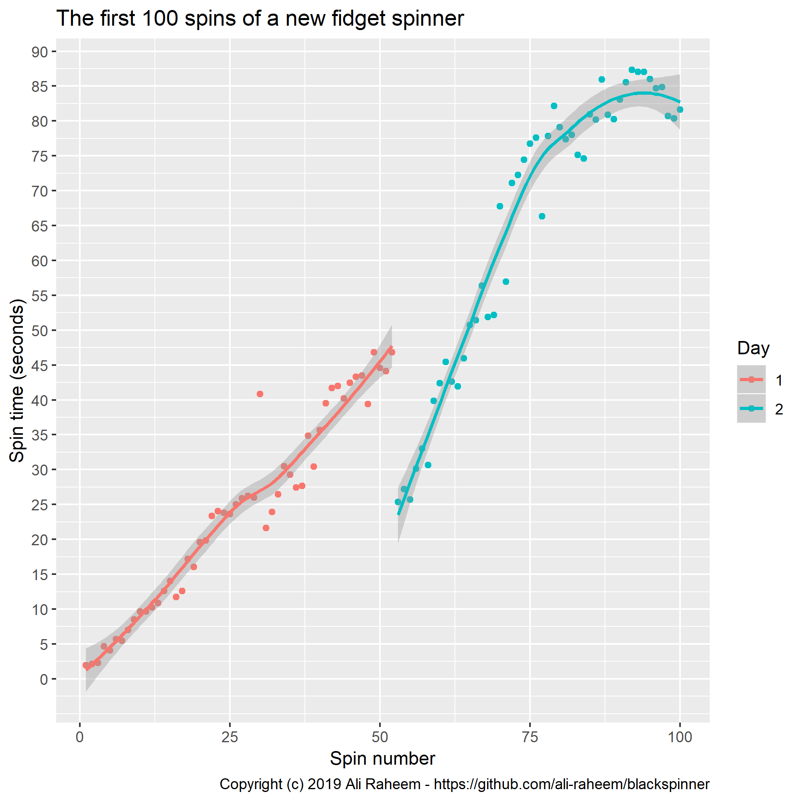

# First 100 spins

MIT licensed dataset of the first 100 spins of a brand new fidget spinner.

## Description

The spins were split over 2 days, in each day the spinner was immediately be respun after each spin. Day 1 and 2 were consequtive days.
There were no spins inbetween the documented spins.
Timing was done using the stopwatch app on an iPhone manually.
The CSV file in this repo contains the data and is pretty much self explanatory.

## The spinner

## The results

### Dicussion

It's really quite striking how linear the increase in spin time is. It's fairly noisy probably because it's a noisy process burning in a bearing and because spin as hard as you can isn't a reliable repeatable process. I suspect it improves 1) by clearing away oil from the bearing put there to prevent corrosion in storage, 2) the bearing and oil is cold 3) the manugacturing process means there are burs which will break away as the bearing and spinner are worn in.

A linear model over the entire data (not accounting for the blip warming up the bearing at the start of day 2) had an R^2 of over 0.94 which is impressive.

It seems that towards the end of Day 2 the spin times seemed to tail off, we will have to wait for Day 3 to know what happened there!

I think the fall in spin time at the start of Day 2 is due to the bearing being cooled over night and the lubrication settling again where is shouldn't.

It would be interest, although it would ruin the experiment, to use a compressed air can to accelerate the spinner to high speed then return to daily spins and see if a single fast spin can wear the spinner in quickly.
