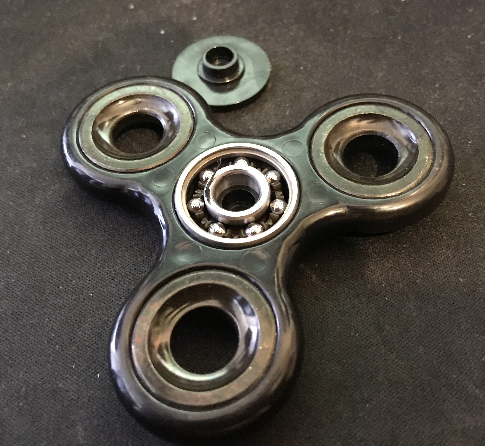

# First 100 spins

MIT licensed dataset of the first 100 spins of a brand new fidget spinner. The spins were split over 2 days, in each day the spinner was immediately be respun after each spin.

There were no spins inbetween the documented spins.

Timing was done using the stopwatch app on an iPhone manually.

## The spinner

## The results

